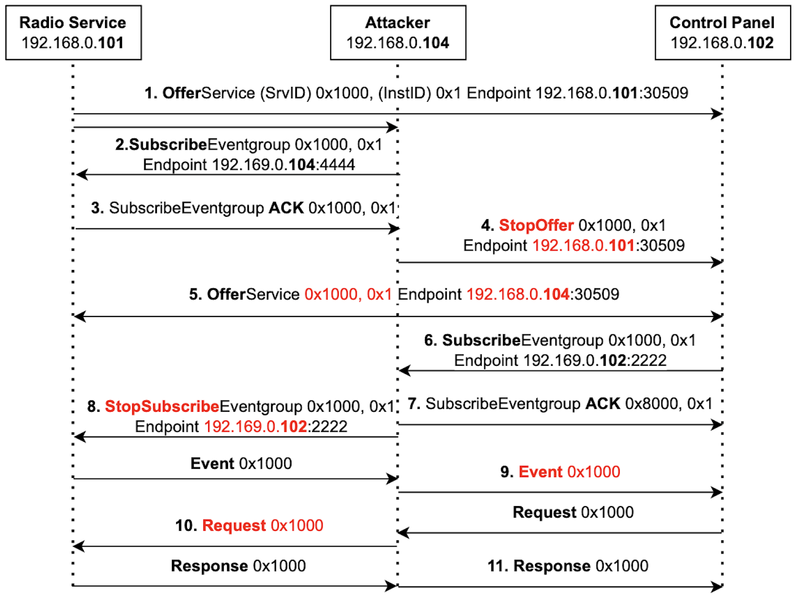

# SOME/IP Publish-Subscribe Man-in-the-Middle Attack

This project demonstrates a Man-in-the-Middle (MITM) attack against a SOME/IP Publish/Subscribe architecture using Scapy. It consists of a simulated Radio Service (Server), a Control Panel (Client), and an Attacker.

## Architecture & Attack Summary



The network consists of three Docker containers:
*   **Radio Service (Server):** `192.168.0.101`
*   **Control Panel (Client):** `192.168.0.102`
*   **Attacker:** `192.168.0.104`

### The Attack Phases
1.  **Information Gathering:** The attacker passively listens for the real `OfferService` broadcast from the server to learn the `ServiceID`, `InstanceID`, and endpoints. It uses this to initialize its `Serverdata` and sends a spoofed offer to bait the client, catching the client's `Subscribe` to initialize `Clientdata`.
2.  **Initial Hooking:** The attacker subscribes to the real Radio Service to receive its data.
3.  **Isolation (MITM):**
    *   The attacker sends a spoofed `StopOffer` to the client (impersonating the server).
    *   The attacker sends a spoofed `StopSubscribe` to the server (impersonating the client).
4.  **Forwarding & Manipulation:** The attacker now acts as a proxy. It intercepts `Events` from the server, modifies their payload (e.g., changes text to "You got Hacked!"), and forwards them to the client.
    *   **Volume Hijacking:** The attacker also manipulates control requests. When the client attempts to increase the volume (`+`), the attacker intercepts the request and changes it to decrease the volume, and vice versa.

---

## Running the Demonstration

### 1. Build the Images
Before running the services for the first time, build the Docker images:
```bash
docker compose build
```

### 2. Start the Normal Network
Start the Server and Client first.
```bash
docker compose up -d server client
```

### 3. Interact with the Radio Client
You can attach to the client to play with the radio controls.
```bash
docker attach someip-pubsub-mitm-client-1
```

**Controls:**
*   `+` / `-` : Increase/Decrease Volume
*   `SPACE` : Switch Radio Station
*   `ESC`   : Turn Radio ON/OFF
*   `Q`     : Quit

*(Press `Ctrl+P, Ctrl+Q` to detach without stopping the container).*

### 4. Launch the Attack
To start the hack, launch the attacker container:
```bash
docker compose run --name attacker-running --rm attacker
```
Watch the client's output. You will see the song text change to **"You got Hacked!"** as the attacker takes control.

---

## Shutdown & Cleanup

To stop the demonstration and clean up the network:

1.  **Stop the Attacker:** Press `Ctrl+C` in the terminal where the attacker is running.
2.  **Stop all Services:**
    ```bash
    docker compose down
    ```
    This stops the server and client and removes the internal network.

---

## Debugging and Development

### Network Debugging (Wireshark & Edgeshark)

**Note on Container Names:** If you started the attacker with `docker compose run --name attacker-running`, use that name in your commands.

**Using tcpdump pipe:**
```bash
docker exec attacker-running tcpdump -i eth0 -U -w - | wireshark -k -i -
```

**Using Edgeshark:**
Alternatively, use [Siemens Edgeshark](https://github.com/siemens/edgeshark) to visually discover and capture traffic from any container's interface via your browser.

### VS Code Debugging (Python Attacker)
1.  **Start Attacker in Debug Mode:**
    Use the specific debug configuration file to enable the debugger listener.
    ```bash
    docker compose -f docker-compose.yml -f docker-compose.debug.yml --profile debug up attacker
    ```
    *You should see: "Starting with debugger listener on port 5678 (waiting for attachment)..."*

2.  **Attach VS Code:** 
    A pre-configured `.vscode/launch.json` is provided. 
    *   Ensure you have opened the root folder in VS Code.
    *   Go to the **Run and Debug** panel.
    *   Select **"Python: Attach Attacker (Docker)"** and hit Play.
